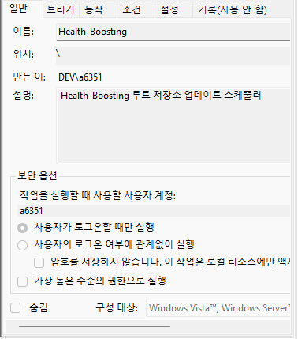

# Submodule 사용 법

## 처음 git 루트 원격 저장소에 올릴 경우

1. git submodule add <원격저장소> <폴더이름>
2. git submodule add <원격저장소> <폴더이름>
3. git commit
4. git push origin main
   > 1. \- branch - 가 설정되어 있을 경우 git push
   > 2. git push --set-upstream origin main

## 루트저장소 받아오는 방법

1. git clone --recurse-submodules <루트 저장소>
2. git submodule update --init --recursive

## 루트 저장소의 서브 모듈들 fetch

1. git fetch
2. git pull origin <branch 이름>

### 참고

- branch가 나뉘어져 있는 서브모듈일 경우 git checkout 잘 확인 해봐야 함 (왜냐면 main만 받아올 가능성이 크기 때문에)

# 루트 저장소 서브 모듈 fetch 자동화 스케줄러 (윈도우 기반)

- powershell 스크립트

  - 참고

  ```
  powershell (보안 오류: (:) [], PSSecurityException) 발생시

    -  Set-ExecutionPolicy -ExecutionPolicy Bypass -Scope Process
    (현재 열린 세션만 보안 해제 cmd 창 닫을 시 원래대로 돌아감)
  ```

```powershell
# update-submodules.ps1

# 루트 저장소 경로 고정 및 이동
$rootPath = "D:\git\projects\health-boosting\web"
Set-Location $rootPath

# 서브모듈 경로 리스트
$submodules = @("frontend", "backend")
$updated = $false

foreach ($submodule in $submodules) {
  Write-Host "Updating submodule: $submodule"

  $submodulePath = Join-Path $rootPath $submodule
  Set-Location $submodulePath

  # 최신 원격 가져오기
  git fetch

  # 현재 브랜치 확인
  $branch = git rev-parse --abbrev-ref HEAD
  Write-Host "Current branch in ${submodule}: ${branch}"

  # 최신 커밋과 로컬 커밋 비교
  $localCommit = git rev-parse HEAD
  $remoteCommit = git rev-parse origin/$branch

  if ($localCommit -ne $remoteCommit) {
    Write-Host "New commits found in $submodule. Pulling latest changes..."
    git pull origin $branch

    # 루트 저장소로 돌아가기
    Set-Location $rootPath
    # 루트 저장소에서 서브모듈 포인터 업데이트
    git add $submodule
    $updated = $true
  } else {
    Write-Host "$submodule is already up to date."
    Set-Location $PWD
  }
}

# 루트 저장소 커밋 & 푸시
if ($updated) {
  git commit -m "Auto update submodules on $(Get-Date -Format 'yyyy-MM-dd HH:mm:ss')"
  git push origin main
  Write-Host "Submodules updated and pushed."
} else {
  Write-Host "No updates detected"
}
```

- 스케줄러 등록

```
1. window 키 -> 작업 스케줄러 검색

2. 작업 만들기 클릭

3. 트리거 탭 -> 새로 만들기 -> 원하는 시간 설정

4. 동작 탭 -> 새로 만들기 -> 프로그램/스크립트에 powershell.exe 입력

5. 인수 추가에 입력
-ExecutionPolicy Bypass -File "D:\git\projects\health-boosting\web\update-submodules.ps1"

  <-ExecutionPolicy Bypass 필수>

6. 조건 및 설정 탭에서 필요시 옵션 조정 후 저장
```




### 참고

- bash 쉘, WSL 스크립트

```bash
#!/bin/bash

# 루트 저장소 절대 경로 설정 (경로는 필요시 수정)
ROOT_PATH="/mnt/d/git/projects/health-boosting/web"
cd "$ROOT_PATH" || exit 1

# 서브모듈 목록
submodules=("frontend" "backend")

# 변경 여부 추적
updated=false

for submodule in "${submodules[@]}"; do
  echo "Updating submodule: $submodule"

  cd "$ROOT_PATH/$submodule" || continue

  # 최신 원격 가져오기
  git fetch

  # 현재 브랜치 확인
  branch=$(git rev-parse --abbrev-ref HEAD)
  echo "Current branch in $submodule: $branch"

  # 로컬 vs 원격 커밋 비교
  localCommit=$(git rev-parse HEAD)
  remoteCommit=$(git rev-parse origin/"$branch")

  if [ "$localCommit" != "$remoteCommit" ]; then
    echo "New commits found in $submodule. Pulling latest changes..."
    git pull origin "$branch"

    # 루트로 돌아가 서브모듈 포인터 갱신
    cd "$ROOT_PATH" || exit 1
    git add "$submodule"
    updated=true
  else
    echo "$submodule is already up to date."
  fi
done

# 루트 저장소 커밋 & 푸시
if [ "$updated" = true ]; then
  git commit -m "Auto update submodules on $(date '+%Y-%m-%d %H:%M:%S')"
  git push origin main
  echo "Submodules updated and pushed."
else
  echo "No updates detected"
fi
```
